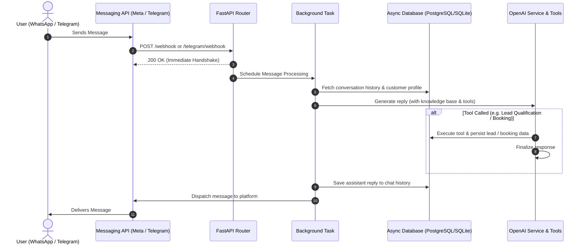

# FastAPI WhatsApp & Telegram AI Agent & CRM Template — Setup & Integration Guide

This guide covers everything needed to configure, connect, and integrate the FastAPI AI Agent & CRM boilerplate.

---

## Table of Contents

1. [Secret Keys & Token Generation](#1-secret-keys--token-generation)
2. [Meta Permanent WhatsApp System User Token](#2-meta-permanent-whatsapp-system-user-token)
3. [Cloudflare Tunnel & Webhook Setup](#3-cloudflare-tunnel--webhook-setup)
4. [n8n Workflow & Automation Integration](#4-n8n-workflow--automation-integration)
5. [Architecture & Request Execution Flow](#5-architecture--request-execution-flow)

---

## 1. Secret Keys & Token Generation

To secure the internal API endpoints (`/whatsapp/send`, admin authorization) and generate secure `VERIFY_TOKEN` strings, use cryptographically secure 32-byte Base64 strings.

### Generation Commands

| Environment | Command |
|---|---|
| **PowerShell** | `$bytes = [byte[]]::new(32); [System.Security.Cryptography.RandomNumberGenerator]::Create().GetBytes($bytes); [System.Convert]::ToBase64String($bytes)` |
| **Linux / macOS / Git Bash** | `openssl rand -base64 32` |
| **Windows CMD** | `powershell -NoProfile -Command "$bytes = [byte[]]::new(32); [System.Security.Cryptography.RandomNumberGenerator]::Create().GetBytes($bytes); [System.Convert]::ToBase64String($bytes)"` |

Copy the generated output and place it into `.env` for `INTERNAL_API_KEY` and `VERIFY_TOKEN`.

---

## 2. Meta Permanent WhatsApp System User Token

The temporary access token in the Meta App Dashboard expires frequently and causes `401 Unauthorized` errors. Use a **System User Access Token** for production and continuous development.

### Step-by-Step Instructions:

1. **Open Meta Business Settings**: Go to [business.facebook.com/settings](https://business.facebook.com/settings) and select your Business Account.
2. **Create a System User**:
   - Go to **Users > System Users** in the left menu.
   - Click **+ Add**, name it (e.g. `whatsapp_agent_user`), and assign role **Admin**.
3. **Assign Assets**:
   - Click **Add Assets**.
   - Under **Apps**, select your app and toggle **Manage app (Full Control)**.
   - Under **WhatsApp accounts**, select your WhatsApp Business Account and toggle **Everything (Full Control)**.
   - Click **Save Changes**.
4. **Generate the Token**:
   - With the system user selected, click **Generate new token**.
   - Select your App.
   - Set Token Expiration to **60 days** (or permanent if available).
   - Select the required permissions:
     - `whatsapp_business_management`
     - `whatsapp_business_messaging`
   - Click **Generate Token** and copy the token immediately (it will only be shown once).
5. **Update `.env`**:
   - Set `WHATSAPP_TOKEN="<your_generated_token>"` in `.env`.
   - Restart the application.

---

## 3. Cloudflare Tunnel & Webhook Setup

Cloudflare Tunnels expose your local server (`http://localhost:8000`) securely to the public internet with a persistent HTTPS domain (replacing ngrok).

### 1. Install & Authenticate `cloudflared`
```bash
# Verify installation
cloudflared --version

# Authenticate with Cloudflare
cloudflared tunnel login
```

### 2. Create Named Tunnel
```bash
cloudflared tunnel create whatsapp-agent-tunnel
```
This creates a tunnel credentials JSON file in `~/.cloudflared/<tunnel-uuid>.json`.

### 3. Local Tunnel Config (`.cloudflared/config.yml`)
Create `.cloudflared/config.yml` in the project root:
```yaml
tunnel: whatsapp-agent-tunnel
credentials-file: 'C:\path\to\whatsapp-fastapi-agent\.cloudflared\cred.json'

ingress:
  - hostname: whatsapp-agent.yourdomain.com
    service: http://localhost:8000
  - service: http_status:404
```
*(Copy your `<tunnel-uuid>.json` into `.cloudflared/cred.json` and ensure `.cloudflared/cred.json` is in `.gitignore`).*

### 4. Route DNS
```bash
cloudflared tunnel route dns whatsapp-agent-tunnel whatsapp-agent.yourdomain.com
```

### 5. Configure Meta Webhook
1. Go to [Meta Developer Dashboard](https://developers.facebook.com/) > **WhatsApp** > **Configuration**.
2. Set **Callback URL**: `https://whatsapp-agent.yourdomain.com/whatsapp/webhook`
3. Set **Verify Token**: Must match `VERIFY_TOKEN` in `.env`.
4. Click **Verify and Save**, then under **Webhook fields**, subscribe to `messages`.

### 6. Running in Development
- **Terminal 1**: `uvicorn main:app --reload --port 8000`
- **Terminal 2**: `cloudflared tunnel --config .\.cloudflared\config.yml run whatsapp-agent-tunnel`

---

## 4. Telegram Bot Integration

The agent natively supports Telegram alongside WhatsApp. Both channels share the same AI business knowledge, dynamic tool calling, customer database, and Admin CRM dashboard.

### 1. Bot Setup
1. Message **[@BotFather](https://t.me/BotFather)** on Telegram.
2. Send `/newbot` to create your bot and copy your HTTP API token.
3. Add to your `.env`:
   ```env
   TELEGRAM_BOT_TOKEN="your_telegram_bot_token"
   TELEGRAM_WEBHOOK_SECRET="your_secure_webhook_secret"
   ```

### 2. Set Telegram Webhook
Once your server is running publicly (e.g. via Cloudflare tunnel or cloud domain):

**PowerShell:**
```powershell
$botToken = "<YOUR_TELEGRAM_BOT_TOKEN>"
$webhookUrl = "https://whatsapp-agent.yourdomain.com/telegram/webhook"
$secret = "<YOUR_TELEGRAM_WEBHOOK_SECRET>"

Invoke-RestMethod -Uri "https://api.telegram.org/bot$botToken/setWebhook" `
  -Method Post `
  -ContentType "application/json" `
  -Body (@{ url = $webhookUrl; secret_token = $secret } | ConvertTo-Json)
```

**cURL:**
```bash
curl -X POST "https://api.telegram.org/bot<YOUR_TELEGRAM_BOT_TOKEN>/setWebhook" \
     -H "Content-Type: application/json" \
     -d '{"url": "https://whatsapp-agent.yourdomain.com/telegram/webhook", "secret_token": "<YOUR_TELEGRAM_WEBHOOK_SECRET>"}'
```

---

## 5. n8n Workflow & Automation Integration

Use the secure `/whatsapp/send` or `/telegram/send` endpoint in n8n (or any external service) to trigger outbound messages.

### Endpoint Details
- **WhatsApp**: `POST https://whatsapp-agent.yourdomain.com/whatsapp/send`
- **Telegram**: `POST https://whatsapp-agent.yourdomain.com/telegram/send`
- **Headers**:
  - `Content-Type: application/json`
  - `x-api-key: <YOUR_INTERNAL_API_KEY>`

### n8n "HTTP Request" Node Setup

1. **Method**: `POST`
2. **URL**: `https://whatsapp-agent.yourdomain.com/whatsapp/send` (or `/telegram/send`)
3. **Authentication**: `Generic Credential Type` -> `Header Auth`
   - **Name**: `x-api-key`
   - **Value**: Your `INTERNAL_API_KEY` from `.env`
4. **Body Parameters** (JSON):
   - `to`: Recipient phone number or Telegram chat ID (e.g. `tg_12345678`)
   - `text`: Message body string (e.g. `{{ $json.message }}`)

---

## 6. Architecture & Request Execution Flow

The backend handles messages asynchronously to reply immediately to webhooks with `200 OK` while processing the AI response and tool calls in the background.



### Execution Steps
1. **Webhook Ingestion**: `/whatsapp/webhook` or `/telegram/webhook` receives payload, verifies signature/structure, and dispatches to background tasks.
2. **Context Assembly**: Retrieves recent conversation history (configurable limit) and customer language preference from the database.
3. **AI Reasoning & Tool Invocation**: OpenAI determines intent, retrieves business profile data, and autonomously triggers database tools (`save_qualified_lead`, `book_service_consultation`, `set_preferred_language`).
4. **Persistence & Outbound Dispatch**: Records the interaction in the database and sends the response message back via the corresponding platform API.
